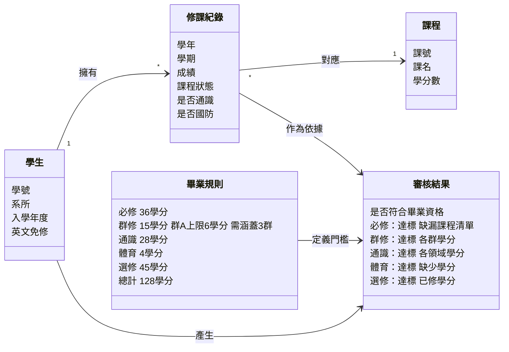
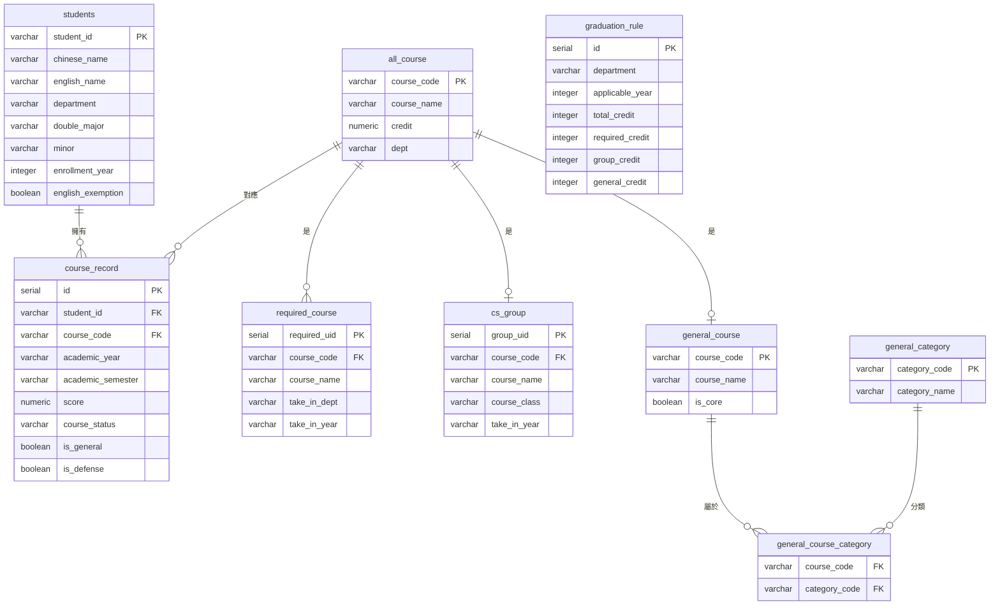
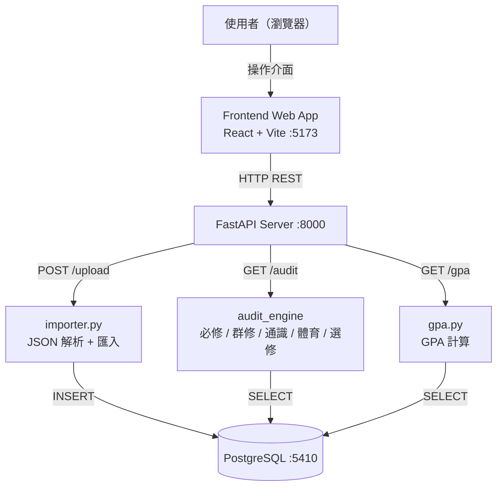

# Graduation Audit System

針對國立政治大學資訊科學系 112 學年入學學生設計的畢業學分審核系統。
學生上傳全人系統匯出的選課紀錄 JSON，系統自動審查必修、群修、通識、體育、自由選修各類別是否達到畢業門檻（總計 128 學分），並視覺化呈現學分進度與缺漏項目。

> 目前僅支援資科系 112 學年入學畢業規則，不審查雙主修、輔系資格。

---

## 專案結構

```
graduation-audit/
├── .env                         # 資料庫連線設定（唯一設定點）
├── requirements.txt             # Python 套件清單
├── data/                        # 全人系統匯出的學生 JSON（測試用）
├── database/
│   ├── docker-compose.yml       # PostgreSQL + 後端容器設定
│   └── schema.sql               # 資料庫建表 DDL（容器啟動時自動執行）
├── logic/                       # 後端（FastAPI + 審核邏輯）
│   ├── Dockerfile
│   ├── run.py                   # 畢業審核 CLI（不透過 API 直接執行）
│   ├── gpa.py                   # GPA 計算 CLI（不透過 API 直接執行）
│   └── app/
│       ├── main.py              # FastAPI 主程式
│       ├── config.py            # 連線池設定
│       ├── models.py            # SQLAlchemy ORM 模型
│       ├── db/
│       │   ├── queries.py       # DB 查詢封裝
│       │   └── importer.py      # JSON 解析 + 存入 DB
│       └── audit/               # 各類別審核邏輯
│           ├── cs_rules/        # 必修 & 群修
│           └── general_rules/   # 通識、體育、自由選修
└── frontend/                    # 前端（React + Vite）
    ├── src/
    │   ├── pages/               # Dashboard / Audit / GPA / Courses / Upload
    │   ├── components/          # 共用元件
    │   └── context/             # StudentContext（存 student_id）
    └── package.json
```

---

## 技術棧

| 層級 | 技術 |
|------|------|
| 前端 | React 19、Vite、Tailwind CSS、Recharts |
| 後端 | Python 3.12、FastAPI、uvicorn |
| 審核邏輯 | Python（純邏輯，無框架依賴） |
| 資料庫 | PostgreSQL 16 |
| 容器化 | Docker Compose |

---

## 啟動（完整系統：前端 + 後端 + DB）

### 環境需求

- Docker & Docker Compose
- Node.js 18+

### 第 1 步：Clone 專案

```bash
git clone <repo-url>
cd graduation-audit
```

### 第 2 步：建立 `.env`

複製範本即可，預設值通常不需要修改：

```bash
cp .env.example .env
```

```
DB_HOST=127.0.0.1
DB_PORT=5410
DB_NAME=myapp
DB_USER=admin
DB_PASSWORD=123456
```

### 第 3 步：啟動後端與資料庫

**方法一：使用腳本（推薦）**

```bash
chmod +x run.sh   # 第一次需要
./run.sh up
```

**方法二：直接下指令**

```bash
docker compose -f ./database/docker-compose.yml --env-file ./.env up -d --build
```

這個指令會同時啟動：
- `my-postgres`：PostgreSQL，自動執行 `schema.sql` 建立所有資料表
- `my-backend`：FastAPI，監聽 `http://localhost:8000`

確認兩個容器都正常：

```bash
docker ps
# 應看到 my-postgres (healthy) 和 my-backend (up)
```

API 文件：`http://localhost:8000/docs`

### 第 4 步：啟動前端

**方法一：使用腳本（另開一個終端）**

```bash
./run.sh frontend
```

**方法二：直接下指令**

```bash
cd frontend
npm install   # 第一次需要
npm run dev
```

開啟瀏覽器前往 `http://localhost:5173`，上傳全人系統匯出的 JSON 即可使用。

---

## run.sh 腳本說明

| 指令 | 說明 |
|------|------|
| `./run.sh up` | 啟動後端 + 資料庫 |
| `./run.sh down` | 停止後端 + 資料庫 |
| `./run.sh restart` | 重啟後端 + 資料庫 |
| `./run.sh frontend` | 啟動前端 dev server |
| `./run.sh logs` | 查看後端 + 資料庫 logs |

---

## 直接執行（CLI，不透過前端）

適合開發或除錯時快速看結果，需要先建立 Python 虛擬環境：

```bash
# 在專案根目錄
python -m venv .venv

# Windows (PowerShell)
.venv\Scripts\activate
# macOS/Linux
source .venv/bin/activate

pip install -r requirements.txt
```

### 畢業審核

```bash
cd logic
python run.py      # Windows
python3 run.py     # macOS/Linux
```

> 修改 `logic/run.py` 底部 `main()` 裡的 `student_id` 可切換學生。


### GPA 計算

```bash
cd logic
python gpa.py      # Windows
python3 gpa.py     # macOS/Linux
```

> 修改 `logic/gpa.py` 底部 `main()` 裡的 `student_id` 可切換學生。

---

## API 端點

| 方法 | 路徑 | 說明 |
|------|------|------|
| `POST` | `/upload` | 上傳全人 JSON，解析存入 DB |
| `GET` | `/student/{id}` | 學生基本資料 |
| `GET` | `/audit/{id}` | 完整畢業審核結果 |
| `GET` | `/gpa/{id}` | GPA 逐學期計算 |
| `GET` | `/courses/{id}` | 完整修課紀錄 |

---

## 常見操作

### 重置資料庫

```bash
# 停止並刪除容器與 volume
docker compose -f ./database/docker-compose.yml down -v

# 重新啟動（自動重新初始化 schema）
docker compose -f ./database/docker-compose.yml --env-file ./.env up -d --build
```

### 查看後端 log

```bash
docker logs my-backend -f
```

### 進入資料庫確認資料

```bash
docker exec -it my-postgres psql -U admin -d myapp
```

```sql
\dt                                    -- 列出所有資料表
SELECT student_id, chinese_name FROM students;
\q
```

---

## 資料庫連線設定說明

| 設定檔 | 讀取方式 |
|--------|---------|
| `database/docker-compose.yml` | `--env-file ./.env` 傳入，以 `${DB_*}` 代入 |
| `logic/app/config.py` | python-dotenv，路徑由 `__file__` 計算至根目錄 |

後端容器內部透過 Docker network 直連 `postgres:5432`，不走 host port，`DB_PORT` 僅供本機開發使用。


## 系統設計

### 領域分析圖



### ER Diagram



### 系統架構圖


